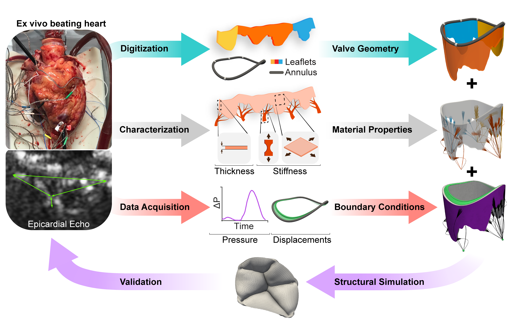
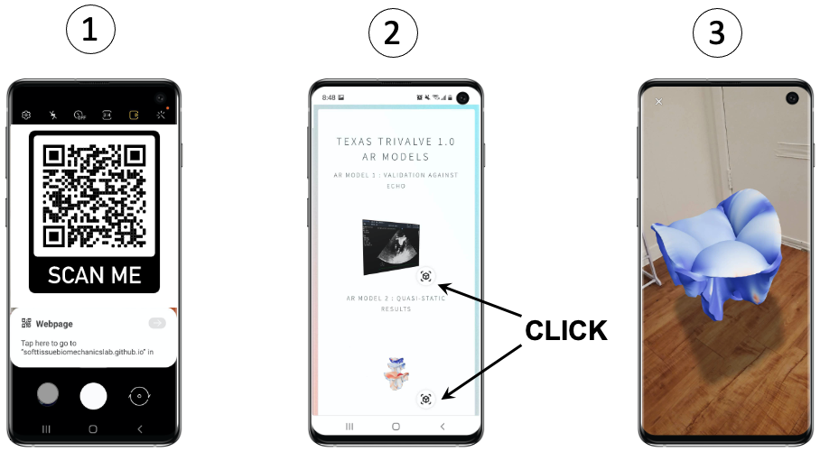

# Texas TriValve

## Requirements
* To run Texas TriValve 1.0 models you will need a FORTRAN compiler linked to your installation of Abaqus. 
* To view the augmented reality models you will need a smartphone compatible with [model-viewer](https://modelviewer.dev/). Click [here](https://softtissuebiomechanicslab.github.io/EngWithCompModels.html) or scan the QR code below to begin. 

## Data description

## Code description
